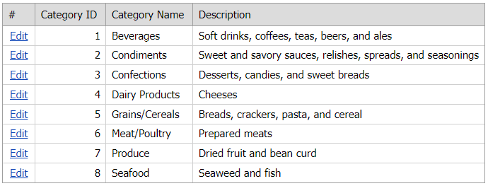

<!-- default badges list -->

[](https://supportcenter.devexpress.com/ticket/details/E4283)
[](https://docs.devexpress.com/GeneralInformation/403183)
<!-- default badges end -->
# Grid View for ASP.NET Web Forms - How to specify a custom button action for particular grid rows
<!-- run online -->
**[[Run Online]](https://codecentral.devexpress.com/e4283/)**
<!-- run online end -->

This example demonstrates how to create a custom **Edit** button and specify its action based on the row's visible index.



## Overview

Follow the steps below:

1. Create the [Grid View](https://docs.devexpress.com/AspNet/DevExpress.Web.ASPxGridView) control and bind it to a data source. Add a [GridViewCommandColumn](https://docs.devexpress.com/AspNet/DevExpress.Web.GridViewCommandColumn) and use the [CustomButtons](https://docs.devexpress.com/AspNet/DevExpress.Web.GridViewCommandColumn.CustomButtons) property to create a custom **Edit** button.

    ```aspx
    <asp:AccessDataSource ID="ads" runat="server" DataFile="~/App_Data/NorthWind.mdb"
        SelectCommand="SELECT [CategoryID], [CategoryName], [Description] FROM [Categories]">
    </asp:AccessDataSource>
    <dx:ASPxGridView ID="gv" ClientInstanceName="gv" runat="server" AutoGenerateColumns="False"
        KeyFieldName="CategoryID" DataSourceID="ads" ...>
        <ClientSideEvents CustomButtonClick="gv_OnCustomButtonClick" />
        <Columns>
            <dx:GridViewCommandColumn VisibleIndex="0">
                <CustomButtons>
                    <dx:GridViewCommandColumnCustomButton ID="EditBnt" Text="Edit" />
                </CustomButtons>
            </dx:GridViewCommandColumn>
            <!-- ... -->
        </Columns>
        <!-- ... -->
    </dx:ASPxGridView>
    ```

2. Handle the grid's client-side [CustomButtonClick](https://docs.devexpress.com/AspNet/js-ASPxClientGridView.CustomButtonClick) event. Use the row's visible index to indicate whether the row is odd or even. Call the grid's [StartEditRow](https://docs.devexpress.com/AspNet/js-ASPxClientGridView.StartEditRow(visibleIndex)) method to start editing even rows. For odd rows, specify an alert message.

    ```js
    function gv_OnCustomButtonClick(s, e) {
        if (e.visibleIndex % 2 === 0)
            alert("You cannot edit this row!");
        else
            s.StartEditRow(e.visibleIndex);
    }
    ```

## Files to Review

* [Default.aspx](./CS/WebSite/Default.aspx) (VB: [Default.aspx](./VB/WebSite/Default.aspx))

## Documentation

* [StartEditRow](https://docs.devexpress.com/AspNet/js-ASPxClientGridView.StartEditRow(visibleIndex))
* [Custom Buttons](https://docs.devexpress.com/AspNet/DevExpress.Web.GridViewCommandColumn.CustomButtons)
* [CustomButtonClick](https://docs.devexpress.com/AspNet/js-ASPxClientGridView.CustomButtonClick)
